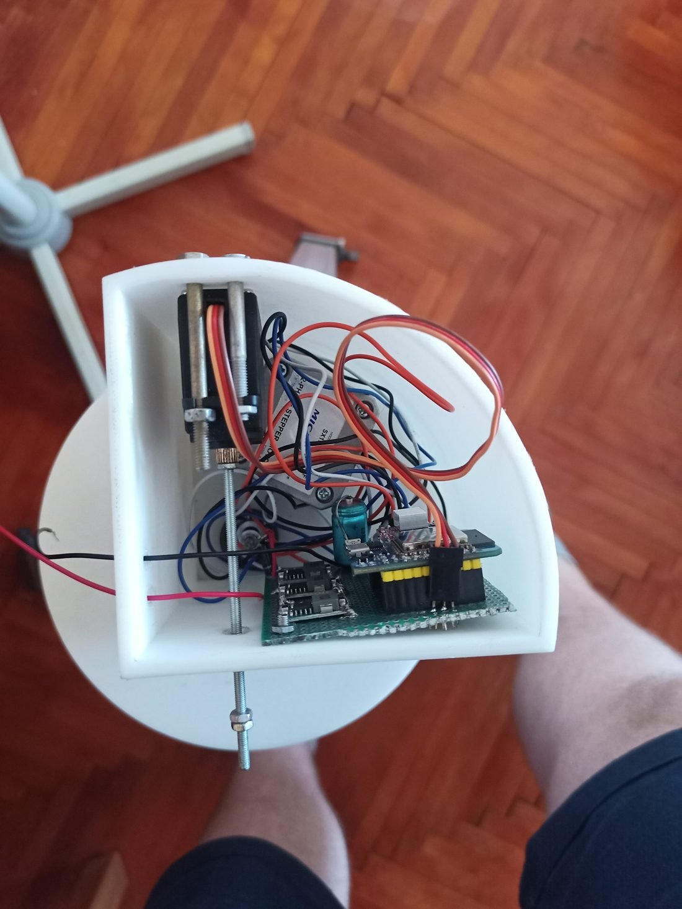
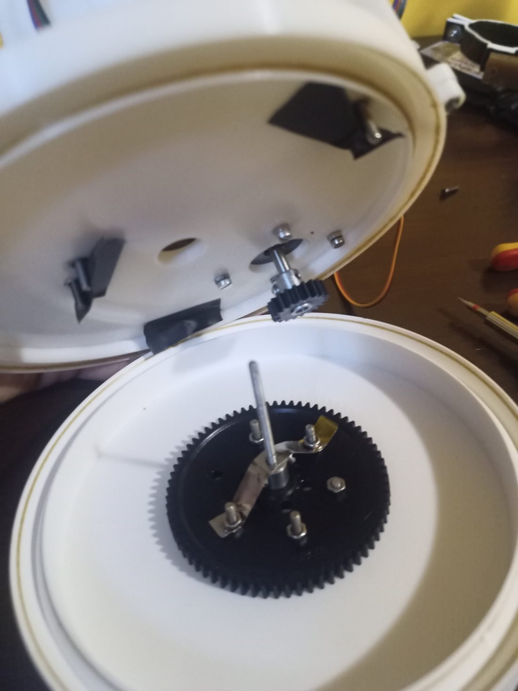
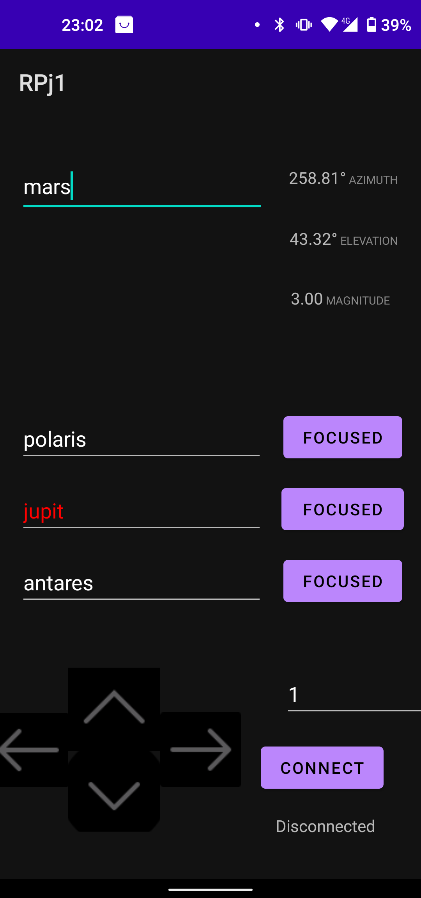
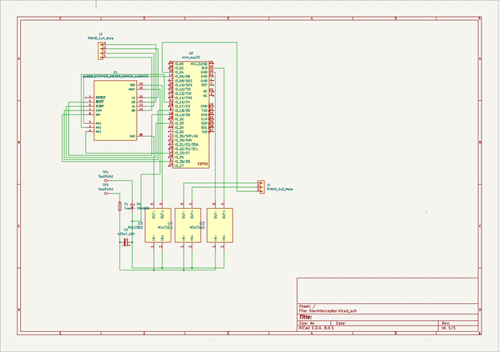
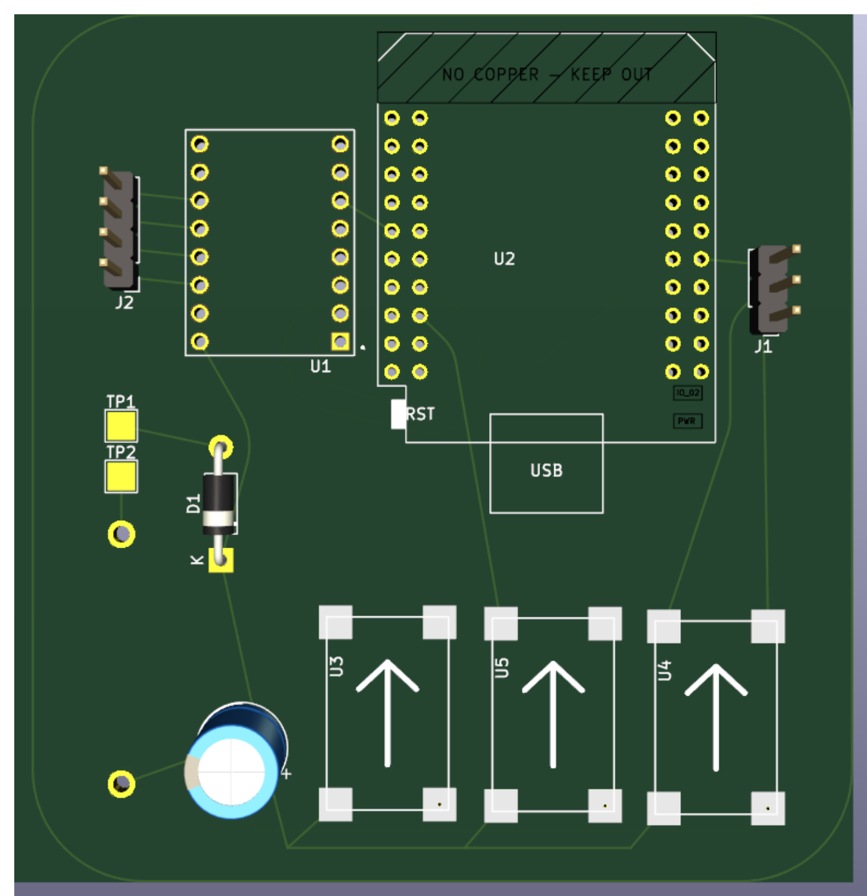
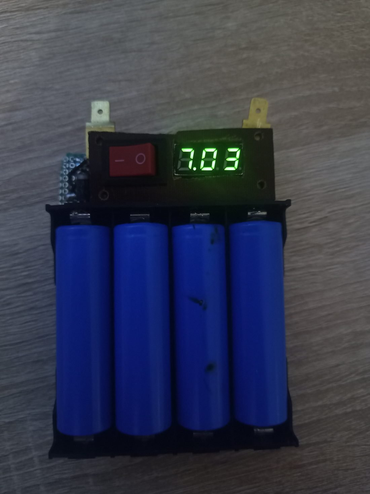
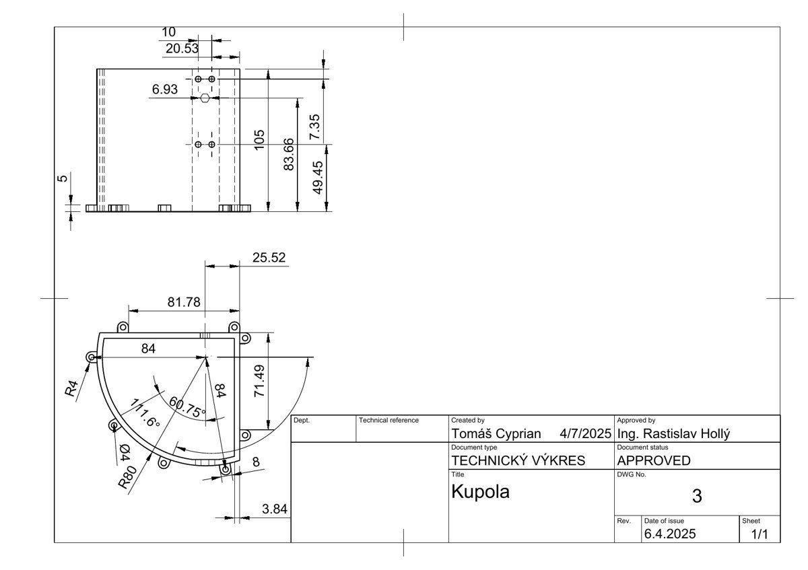
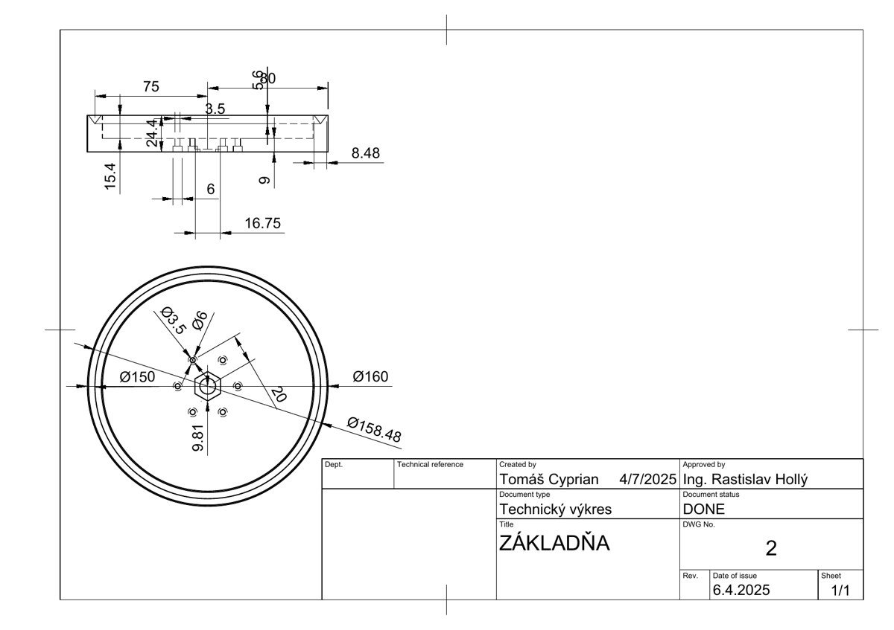

# Star Interceptor MK III

**An autonomous celestial-tracking telescope mount — designed and built end to end: mechanism, technical drawings, custom PCB, firmware, and control app.**

A low-cost, portable two-axis mount that works out where a celestial object sits in the sky from your time and location, then drives itself to follow it across the sky — on its own, for up to 24 hours.

*Regional winner and national finalist, Festival of Science & Technology (AMAVET).*



---

## Overview

I built this because the cheap telescope I had as a kid sat on a tripod too flimsy to hold the full Moon steady in view — and the computer-controlled mount I'd been promised never got built. So I spent about a year researching the technologies it would need and built it myself.

The goal was a genuinely affordable, durable, portable platform that points a telescope precisely from a smartphone — and, just as much, a project to push my own engineering across every layer: mechanical design, electronics, firmware, and software.

The result is a working instrument that ran in front of a competition jury twice, in two countries.

---

## How it works

The system answers one question, continuously: **where is this object right now?** From the observer's coordinates, elevation and the current time, it computes the target's apparent position, converts that into a pair of axis angles — azimuth and altitude — and drives the mount to match, recomputing as the sky moves.

```
observer location + time + target  →  celestial-position computation  →  azimuth / altitude  →  two-axis motion
```

---

## The build — three generations, each solving the last one's failure

The mount wasn't designed once and finished. It evolved through **diagnosed failures** — each version fixed a specific, observed problem in the one before. That loop of build → test → find the real fault → redesign is the core of the project.

**Generation 1 — dual stepper, H-bridge drive.**
Both axes driven by stepper motors through H-bridges.
*The failure:* with the drivers powered down, the telescope's own weight back-drove the motors and it slipped off target — along with vibration, jitter and audible noise.

**Generation 2 — servo elevation (MG996R).**
Moving elevation to a metal-geared servo with position feedback fixed the back-driving.
*The new failure:* the servo's acceleration couldn't be controlled, so under the inertia of the optics it fell into a chaotic state and couldn't reliably settle on the commanded angle.

**Generation 3 — stepper + worm gear (in development).**
The current direction: a worm-gear-driven stepper for elevation. A worm drive can't be back-driven, raises load capacity, and removes the jerk on pointing changes. This is the MK III.



---

## Software

Celestial positions are computed in **Python**, using the `ephem` library — chosen because it handles far more bodies than the alternatives. The control app is built in **Kotlin** with an XML interface in **Android Studio** (both taught myself for this project), bridged to the Python calculation through **Chaquopy**. The mount runs a **Bluetooth Low Energy** server on the **ESP32**.

The step I'm most proud of is how tracking is handled. In the first version the phone recomputed the target every 10 seconds and pushed the mount a correction. In the second, the phone hands the mount a compact array of upcoming orientations, and the mount then tracks the object **entirely on its own — no phone connection needed — for up to 24 hours.**



---

## Engineering detail: S-curve acceleration

Driven naively, stepper motors start and stop abruptly — which shows up as vibration, noise, and missed steps that cost pointing accuracy. To fix it I derived a **sigmoid-based S-curve acceleration profile**: rather than jumping between step speeds, the firmware ramps the delay between steps smoothly up to speed and back down again, so each axis accelerates and brakes gently. The result is quiet, controlled motion that doesn't shake the optics or lose position.

```cpp
double computeY(double x, double k, double d, double v) {
    double t1 = 1.0 / (1.0 + exp(-k * (x - (2*log(v)/k) + d)));
    double t2 = 1.0 / (1.0 + exp(-k * (x + (2*log(v)/k) - d)));
    return 0 - fabs(t1 - t2) * v;   // per-step delay along the acceleration curve
}
```

---

## Electronics & power

The electronics began as stepper drivers wired by hand and became a consolidated unit. I moved from **A4988 to DRV8825** drivers for finer microstepping, lower noise and a cleaner control interface, then brought the ESP32, the drivers and a Mini-360 buck converter together onto a **custom PCB designed in KiCad** — a plug-and-play board rather than a breadboard of modules. An SMD revision of the board is already designed.

Power comes from an **18650 pack** I reconfigured from a series/parallel layout into full series, to supply the 8 V+ the DRV8825 drivers need to run.

**Schematic (KiCad)**


**Board layout (KiCad)**


**Power**


> Note: the original KiCad source files were lost; the schematic and board images above are the surviving record of the electronics design.

---

## CAD & technical documentation

The full mechanism was modelled in **Autodesk Fusion 360** and exported through PrusaSlicer for 3D printing. Beyond the models, every part is captured as a **dimensioned technical drawing** — dome and base included — with tolerances, radii, section views and title blocks. This is production documentation, not just a 3D file: drawings another person could manufacture from directly.

| Dome (Kupola) | Base (Základňa) |
|:---:|:---:|
|  |  |

---

## Cost

The affordability goal wasn't a slogan — the complete bill of materials came to **€31.85**. Designing to a real cost target, and hitting it, was part of the engineering brief I set myself.

| Component | Cost |
|---|---|
| ESP32 (Wemos D1 mini) | €9.90 |
| Stepper motor (17HS4023) | ~€2.50 |
| DRV8825 driver | €2.95 |
| Servo (MG996R) | €6.90 |
| 2× Mini-360 buck converter | €0.95 |
| Battery | €7.70 |
| **Total** | **€31.85** |

---

## Recognition

- **Festival of Science & Technology (AMAVET), 2023** — regional winner (Trenčín region), presented in the national final at INCHEBA Bratislava. Category: Physics & Astronomy.
- **Festival of Science & Technology, 2025** — regional round, Pardubice (Czech Republic). Partners included Foxconn and the University of Pardubice.

---

## Repository structure

```
star-interceptor/
├── firmware/     ESP32 firmware (C/C++) — coordinate transform, motor control, BLE server
├── app/          Android control app (Kotlin / XML)
├── calc/         Python celestial-position calculation (ephem)
├── hardware/     KiCad schematic + PCB layout (images)
├── cad/          Fusion 360 exports + dimensioned technical drawings (PDF)
└── docs/images/  Photos, schematic, board render, drawings, app screenshot
```

---

## About

Designed and built by **Tomáš Cyprian** — Applied Informatics (Robotics & Control Systems).
Open to engineering and design work.

📧 cyptomtom@gmail.com

*The project is open for hobbyists and enthusiasts to build on.*
